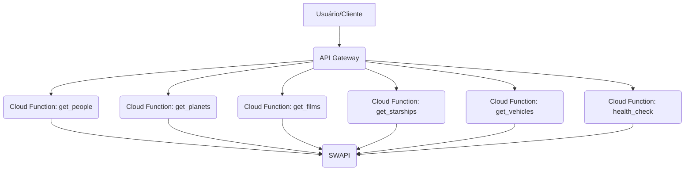

# 🌌 Star Wars API Platform (GCP) - v2

Bem-vindo à plataforma API do universo Star Wars! Este projeto oferece uma API RESTful completa, desenvolvida em Python e hospedada no Google Cloud Platform (GCP), para explorar informações detalhadas sobre personagens, planetas, naves, veículos e filmes da saga. A solução utiliza **Cloud Functions (2ª Geração)** e **API Gateway** para garantir escalabilidade, performance e uma interface unificada.

---

## ✨ Funcionalidades Principais

*   **Cache em Memória (LRU-like)**: Respostas rápidas com cache inteligente e tempo de vida (TTL) configurável.
*   **Enriquecimento Automático de Dados**: URLs de recursos (como `films`, `species`, `vehicles`) são automaticamente resolvidas para seus nomes correspondentes, tornando os dados mais legíveis.
*   **Ordenação Dinâmica**: Permite ordenar os resultados de coleções por qualquer campo (`sort_by`) e em ordem crescente ou decrescente (`order=asc/desc`).
*   **Consultas Correlacionadas**: Capacidade de buscar recursos relacionados a outro recurso (ex: `/people?related_to=films/1` para listar personagens de um filme específico).
*   **Metadados de Auditoria e Performance**: Todas as respostas incluem metadados com timestamp, versão da API e latência da requisição.
*   **Processamento Paralelo**: Utilização de `ThreadPoolExecutor` para otimizar a busca e enriquecimento de múltiplos recursos simultaneamente, especialmente em consultas correlacionadas.


*   **Consulta por Recurso**: Endpoints dedicados para `people`, `planets`, `films`, `starships` e `vehicles`.
*   **Busca por ID**: Acesse recursos específicos diretamente pela URL (ex: `/api/v1/films/1`).
*   **Busca por Filtros**: Filtre resultados por nome, título ou outras propriedades (ex: `/api/v1/people?search=luke`).
*   **Tratamento de IDs Não Sequenciais**: Respostas claras para IDs inexistentes na SWAPI.
*   **Health Check**: Endpoint para verificar a saúde da API e a conectividade com a SWAPI.
*   **API Gateway Unificado**: Uma única URL para acessar todos os endpoints.

---

## 🚀 Arquitetura da Solução

A plataforma é construída com os seguintes serviços do Google Cloud:

*   **Google Cloud Functions (2ª Geração)**: Funções serverless em Python 3.11 que interagem com a SWAPI.
*   **Google Cloud API Gateway**: Atua como uma camada de fachada, unificando todas as Cloud Functions sob uma única URL e gerenciando o roteamento.
*   **SWAPI (Star Wars API)**: Fonte de dados externa para todas as informações do universo Star Wars.



---

## 🛠️ Guia de Implantação (Deploy no GCP)

Siga estes passos para implantar a API no seu projeto Google Cloud. Certifique-se de ter o `gcloud CLI` instalado e autenticado.

### Pré-requisitos

1.  **Conta no Google Cloud Platform**: Se você não tiver uma, [crie uma aqui](https://cloud.google.com/free).
2.  **Google Cloud SDK**: Instale a `gcloud` CLI seguindo [este guia](https://cloud.google.com/sdk/docs/install).
3.  **Projeto GCP**: Crie um novo projeto no [console do GCP](https://console.cloud.google.com/) e **habilite o faturamento**.
4.  **Permissões**: Certifique-se de que sua conta de usuário tenha as seguintes roles no projeto:
    -   `Cloud Functions Admin`
    -   `API Gateway Admin`
    -   `Service Account User`
    -   `Service Management Administrator`
    -   `Cloud Build Editor`

### 1. Configurar o Projeto GCP

Abra seu terminal (CMD ou PowerShell) e navegue até a pasta raiz do projeto `star-wars-api`. Em seguida, defina o ID do seu projeto GCP. Substitua `SEU-ID-DO-PROJETO` pelo ID real do seu projeto (ex: `poetic-brace-486015-v2`).

```cmd
cd C:\caminho\para\sua\pasta\star-wars-api
gcloud config set project SEU-ID-DO-PROJETO
```

### 2. Habilitar APIs Necessárias

Garanta que todas as APIs do GCP necessárias estejam habilitadas. Este comando pode levar alguns minutos:

```cmd
gcloud services enable cloudfunctions.googleapis.com cloudbuild.googleapis.com run.googleapis.com logging.googleapis.com apigateway.googleapis.com servicemanagement.googleapis.com servicecontrol.googleapis.com --project=SEU-ID-DO-PROJETO
```

### 3. Dar Permissão ao Cloud Build

Conceda a permissão necessária para que o Cloud Build possa implantar as funções:

```cmd
gcloud projects add-iam-policy-binding SEU-ID-DO-PROJETO --member="serviceAccount:SEU-ID-DO-PROJETO@cloudbuild.gserviceaccount.com" --role="roles/cloudbuild.builds.builder"
```

### 4. Implantar as Cloud Functions

Execute o comando abaixo para implantar todas as funções. Este processo pode levar de 5 a 10 minutos.

```cmd
for %f in (health_check get_people get_planets get_starships get_vehicles get_films) do gcloud functions deploy %f --gen2 --runtime=python311 --region=southamerica-east1 --source=./functions --entry-point=%f --trigger-http --allow-unauthenticated --project=SEU-ID-DO-PROJETO --quiet
```

### 5. Atualizar o `openapi-spec.yaml`

Após o deploy das funções, o Google Cloud gera URLs únicas para cada uma (ex: `https://get-people-xxxx-rj.a.run.app`). Você precisa atualizar o arquivo `openapi/openapi-spec.yaml` com essas URLs.

**a. Obtenha as URLs das suas funções:**
Para cada função, execute (substitua `SEU-ID-DO-PROJETO`):
```cmd
gcloud functions describe health_check --region=southamerica-east1 --project=project=SEU-ID-DO-PROJETO --format="value(serviceConfig.uri)"
gcloud functions describe get_people --region=southamerica-east1 --project=project=SEU-ID-DO-PROJETO --format="value(serviceConfig.uri)"
# Repita para get_planets, get_films, get_starships, get_vehicles
```

**b. Edite o arquivo `openapi/openapi-spec.yaml`:**
Abra o arquivo `openapi/openapi-spec.yaml` no seu editor e substitua os placeholders `SUA_URL_..._AQUI` pelas URLs reais que você obteve. O arquivo deve ficar assim (com suas URLs):

```yaml
swagger: "2.0"
info:
  title: "star-wars-api"
  version: "1.0.0"
schemes:
  - "https"
paths:
  /api/v1/health:
    get:
      operationId: "healthCheck"
      x-google-backend:
        address: "SUA_URL_HEALTH_CHECK_AQUI"
      responses:
        200:
          description: "Success"

  /api/v1/people:
    get:
      operationId: "getPeople"
      x-google-backend:
        address: "SUA_URL_GET_PEOPLE_AQUI"
      responses:
        200:
          description: "Success"
  /api/v1/people/{id}:
    get:
      operationId: "getPeopleById"
      parameters:
        - name: "id"
          in: "path"
          required: true
          type: "string"
      x-google-backend:
        address: "SUA_URL_GET_PEOPLE_AQUI"
        path_translation: APPEND_PATH_TO_ADDRESS
      responses:
        200:
          description: "Success"

  /api/v1/films:
    get:
      operationId: "getFilms"
      x-google-backend:
        address: "SUA_URL_GET_FILMS_AQUI"
      responses:
        200:
          description: "Success"
  /api/v1/films/{id}:
    get:
      operationId: "getFilmsById"
      parameters:
        - name: "id"
          in: "path"
          required: true
          type: "string"
      x-google-backend:
        address: "SUA_URL_GET_FILMS_AQUI"
        path_translation: APPEND_PATH_TO_ADDRESS
      responses:
        200:
          description: "Success"

  /api/v1/planets:
    get:
      operationId: "getPlanets"
      x-google-backend:
        address: "SUA_URL_GET_PLANETS_AQUI"
      responses:
        200:
          description: "Success"
  /api/v1/planets/{id}:
    get:
      operationId: "getPlanetsById"
      parameters:
        - name: "id"
          in: "path"
          required: true
          type: "string"
      x-google-backend:
        address: "SUA_URL_GET_PLANETS_AQUI"
        path_translation: APPEND_PATH_TO_ADDRESS
      responses:
        200:
          description: "Success"

  /api/v1/starships:
    get:
      operationId: "getStarships"
      x-google-backend:
        address: "SUA_URL_GET_STARSHIPS_AQUI"
      responses:
        200:
          description: "Success"
  /api/v1/starships/{id}:
    get:
      operationId: "getStarshipsById"
      parameters:
        - name: "id"
          in: "path"
          required: true
          type: "string"
      x-google-backend:
        address: "SUA_URL_GET_STARSHIPS_AQUI"
        path_translation: APPEND_PATH_TO_ADDRESS
      responses:
        200:
          description: "Success"

  /api/v1/vehicles:
    get:
      operationId: "getVehicles"
      x-google-backend:
        address: "SUA_URL_GET_VEHICLES_AQUI"
      responses:
        200:
          description: "Success"
  /api/v1/vehicles/{id}:
    get:
      operationId: "getVehiclesById"
      parameters:
        - name: "id"
          in: "path"
          required: true
          type: "string"
      x-google-backend:
        address: "SUA_URL_GET_VEHICLES_AQUI"
        path_translation: APPEND_PATH_TO_ADDRESS
      responses:
        200:
          description: "Success"
```

### 6. Implantar o API Gateway

Agora que o `openapi-spec.yaml` está atualizado, podemos criar e implantar o Gateway. Lembre-se que o API Gateway não está disponível em `southamerica-east1`, então usaremos `us-central1`.

```cmd
# 1. Criar o recurso de API (se já existe, o comando avisará)
gcloud api-gateway apis create star-wars-api --project=SEU-ID-DO-PROJETO

# 2. Criar a configuração da API (usando o arquivo YAML atualizado)
gcloud api-gateway api-configs create star-wars-config-final --api=star-wars-api --openapi-spec=openapi/openapi-spec.yaml --project=SEU-ID-DO-PROJETO

# 3. Criar o Gateway (pode levar 3-5 minutos)
gcloud api-gateway gateways create star-wars-gateway-final --api=star-wars-api --api-config=star-wars-config-final --location=us-central1 --project=SEU-ID-DO-PROJETO
```

### 7. Obter a URL Final do Gateway

Após o Gateway ser implantado, execute este comando para obter a URL pública da sua API:

```cmd
gcloud api-gateway gateways describe star-wars-gateway-final --location=us-central1 --project=SEU-ID-DO-PROJETO --format="value(defaultHostname)"
```

---

## 🧪 Como Testar a API

Com a URL do Gateway em mãos (ex: `https://star-wars-gateway-final-xxxx.uc.gateway.dev`), você pode testar:

*   **Health Check**: `SUA_URL_GATEWAY/api/v1/health`
*   **Personagem por ID**: `SUA_URL_GATEWAY/api/v1/people/1`
*   **Filme por ID**: `SUA_URL_GATEWAY/api/v1/films/1`
*   **Busca de Personagens**: `SUA_URL_GATEWAY/api/v1/people?search=luke`
*   **Veículo Inexistente**: `SUA_URL_GATEWAY/api/v1/vehicles/10` (deve retornar uma mensagem de erro clara)

---

## 📁 Estrutura do Projeto

```
star-wars-api/
├── functions/             # Código Python das Cloud Functions
│   ├── main.py            # Lógica principal da API
│   └── requirements.txt   # Dependências Python
├── openapi/               # Especificação OpenAPI para o API Gateway
│   └── openapi-spec.yaml  # Define os endpoints e roteamento
├── scripts/               # Scripts de automação para deploy e limpeza
│   ├── deploy-functions.sh  # Deploy das Cloud Functions (Linux/Git Bash)
│   ├── deploy-gateway.sh    # Deploy do API Gateway (Linux/Git Bash)
│   └── cleanup.sh           # Limpeza de recursos (Linux/Git Bash)
├── README.md              # Este arquivo
└── RELATORIO_IDS_SWAPI.md # Relatório de IDs válidos da SWAPI
```

---

## 🤝 Contribuição

Contribuições são bem-vindas! Se você tiver ideias para novas funcionalidades, melhorias ou correções de bugs, sinta-se à vontade para abrir uma *issue* ou enviar um *pull request*.

## 📄 Licença

Este projeto é distribuído sob a licença MIT. Veja o arquivo `LICENSE` para mais detalhes.

